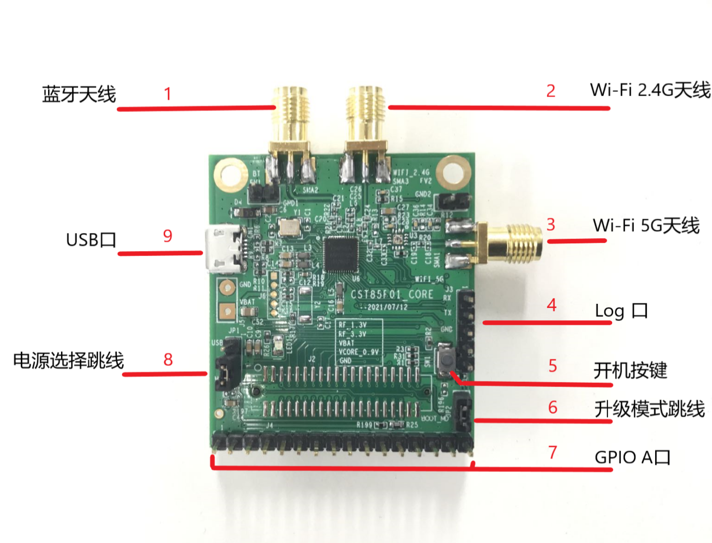
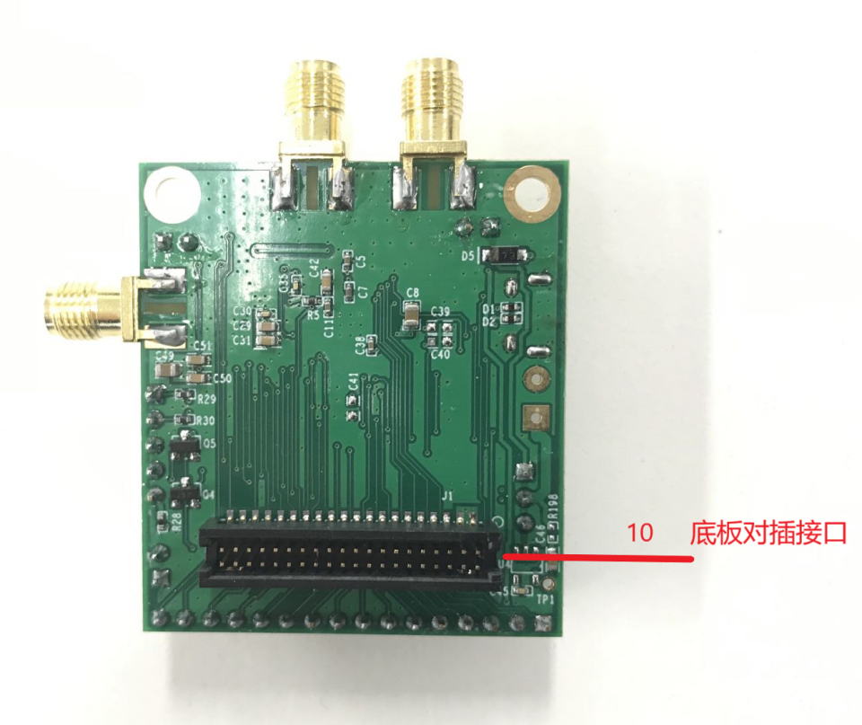
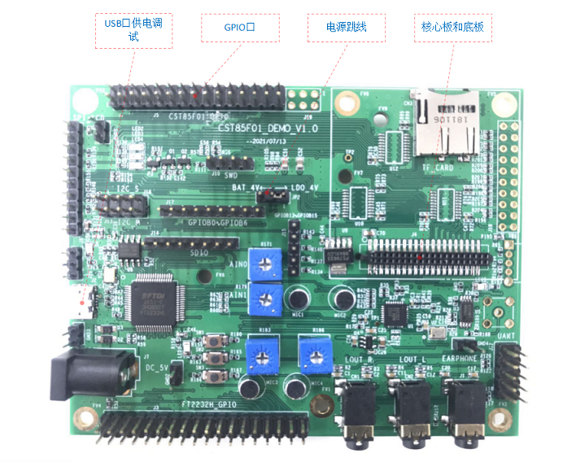
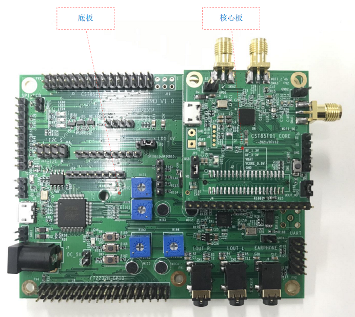
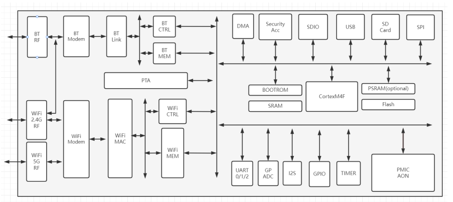
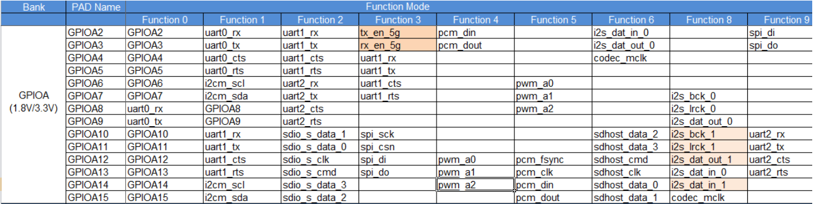

# Chipsea cst85_wblink evb 
## 介绍
cst85_wblink开发板是基于芯海科技cst85f01芯片，由芯海科技出品的一款高性能、多功能、高性价比AIoT SoC开发板。cst85_wblink开发板，集成双频WiFi + 双模蓝牙，支持标准的802.11 a/b/g/n/协议，支持BT/BLE 5.0协议，内建多种容量的RAM（最大992KB）和Flash（最大16MB），支持MIPI DSI及CSI，适用于快速开发物联网(IOT)及智能设备的Wi-Fi、蓝牙的应用。

### 开发板外观图片

**图 1**  核心板图片 <a name=""></a>


**图 2**  核心板底面 <a name=""></a>



**图 3**  底板图片 <a name=""></a>



**图 4**  底板和核心板 <a name=""></a>


### 开发板功能框图及介绍

整个开发板以一颗ContexM4核MCU为核心，外挂串口、SPI、I2C、PWM、ADC等外设以及WIFI和BT模块。为了方便调试，在底板上接了一颗FT2232USB转串口的芯片。

**图 5**  系统架构图 <a name=""></a>


## 开发板规格

|  器件类别	|  开发板|
|  ----  | ----  |
|  CPU	|  Cortex M4 (最高480MHz)|
|  RAM	|  984K SRAM |
|  ROM	|  752K ROM|
|  GPIO	|  GPIOA0~GPIOA15|
|  I2C	|  I2C master + I2C slave|
|  I2S	|  2|
|  UART |  3|
|  SPI	|  2|
|  PWM	|  12|
|  ADC	|  9路 14bits|
|  Debug UART	|  支持|
|  Display Engine	|暂不支持|
|  Touch Screen	|  暂不支持|
|  Wi-Fi	|  WiFi6 2.4G/5G双频|
|  Bluetooth	|  BT5.0，BT classic，LE Audio|
|  PMIC	|  内置|
|  按键	|  power|

## 关键特性
|  组件名	|  能力介绍|
|  ----  | ----  |
|  WLAN服务	|  提供WLAN服务能力。包括：station和hotspot模式的连接、断开、状态查询等。|
|  BLUETOOTH 服务	|  提供蓝牙 BT BLE 等功能。|
|  模组外设控制	|  提供操作外设的能力。包括：I2C、UART、SPI、SDIO、GPIO、PWM、FLASH等。|
|  基础加解密	|  提供密钥管理、加解密等能力。|
|  系统服务管理	|  系统服务管理基于面向服务的架构，提供了OpenHarmony统一化的系统服务开发框架。|
|  启动引导	|  提供系统服务的启动入口标识。在系统服务管理启动时，调用boostrap标识的入口函数，并启动系统服务。|
|  基础库  	|  提供公共基础库能力。包括：文件操作、KV存储管理等。|
|  XTS	|  提供OpenHarmony生态认证测试套件的集合能力。|
|  HDF	|  提供OpenHarmony硬件配置驱动的能力。|
|  Kconfig	|  提供内核配置能力。|


## 引脚定义


## 搭建开发环境


### 系统要求
系统要求基于Cortex-m4的liteos_m内核操作系统，采用arm-none-eabi-gcc 10.3版本toolchain,
提供992K内存和2MB flash系统配置。

OpenHarmony在基于cst85f01 的芯片的cst85_wblink模组，依赖liteos_m内核，内核依赖 cortex-m4架构配置，编译依赖arm官方的arm-none-eabi-gcc 10.3版本。
OpenHarmony需要按照官方文档介绍安装环境 ，然后编译出烧录包，按照文档介绍烧录:
https://gitee.com/openharmony-sig/device_soc_chipsea/blob/master/README_zh.md


### 工具要求
Ubuntu18.04编译，Windows10系统烧录。

1.	Ubuntu18.04系统安装
    ```
    sudo apt-get install build-essential gcc g++ make zlib* libffi-dev e2fsprogs pkg-config flex bison perl bc openssl libssl-dev libelf-dev libc6-dev-amd64 binutils binutils-dev libdwarf-dev u-boot-tools mtd-utils gcc-arm-linux-gnueabi
    ```

2.	Ubuntu18.04安装python3和pip3
    ```
    python3 -m pip install --user ohos-build
    ```

3.	Ubuntu18.04 配置tooLchain [arm-none-eabi-gcc](https://developer.arm.com/-/media/Files/downloads/gnu-rm/10.3-2021.10/gcc-arm-none-eabi-10.3-2021.10-x86_64-linux.tar.bz2):

    下载[arm-none-eabi-gcc 编译工具](https://developer.arm.com/-/media/Files/downloads/gnu-rm/10.3-2021.10/gcc-arm-none-eabi-10.3-2021.10-x86_64-linux.tar.bz2)
    解压 [gcc-arm-none-eabi-10.3-2021.10-x86_64-linux.tar.bz2](https://developer.arm.com/-/media/Files/downloads/gnu-rm/10.3-2021.10/gcc-arm-none-eabi-10.3-2021.10-x86_64-linux.tar.bz2) 安装包至\~/toolchain/路径下。

       ```shell
       mkdir -p ~/toolchain/
       tar -zxvf gcc-arm-none-eabi-10.3-2021.10-x86_64-linux.tar.bz2 -C ~/toolchain/
       ```
    设置环境变量

       ```
       vim ~/.bashrc
       ```

       将以下命令拷贝到.bashrc文件的最后一行，保存并退出。

       ```
       export PATH=~/toolchain/gcc-arm-none-eabi-10.3-2021.10/bin:$PATH
       ```
    生效环境变量

       ```
       source ~/.bashrc
       ```

4.	安装 FT2232H USB 转串口驱动程序

### 搭建过程

https://gitee.com/openharmony-sig/device_soc_chipsea/blob/master/README_zh.md

## 编译调试

https://gitee.com/openharmony-sig/device_soc_chipsea/blob/master/README_zh.md

按下开发板上开关按钮，通过串口调试工具打印串口log。

## 首个示例

vendor_chipsea仓有XTS示例、连接示例和软总线实例。见[vendor_chipsea](https://gitee.com/openharmony-sig/vendor_chipsea)

## 参考资源

https://gitee.com/openharmony-sig/device_soc_chipsea/blob/master/README_zh.md


## 联系


**********
